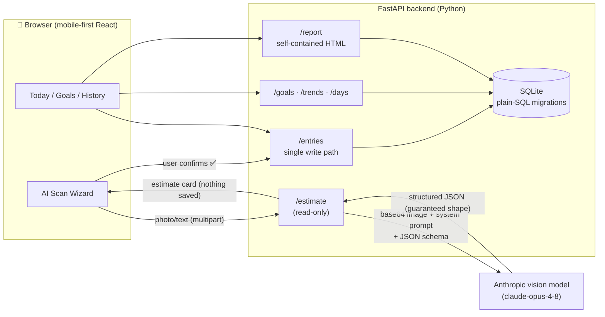

# 🥗 Calorie Tracker — AI meal logging with a paper trail

A **mobile-first web app** that turns a photo of your meal — or of a
nutrition label — into validated calories and macros via a **vision AI**,
tracked against **TDEE-based targets**. Built AI-assisted ("vibe coded"),
but with the discipline of a real project: a functional spec agreed before
any code, a living sprint backlog, **57 passing tests**, and a written
retrospective of every decision and lesson.

**Headline:** from empty folder to feature-complete in 6 sprints — photo →
structured estimate → user-confirmed entry → daily targets → trends → an
HTML progress report that opens with **zero network access**. The first live
AI call correctly identified Hainanese chicken rice from text alone and
estimated **1150 kcal** with its assumptions listed and its confidence
honestly marked *low*.

---

## Table of contents

- [What this project does](#what-this-project-does)
- [Architecture](#architecture)
- [How it works, in plain language](#how-it-works-in-plain-language)
- [The tracker core](#1-the-tracker-core--one-write-path)
- [Goals & TDEE](#2-goals--tdee-never-overwrite-history)
- [The AI estimation pipeline](#3-the-ai-estimation-pipeline)
- [Trends & the offline report](#4-trends--the-offline-report)
- [Real examples (captured live)](#real-examples-captured-live)
- [Results](#results)
- [How it was built — and what it taught](#how-it-was-built--and-what-it-taught)
- [Project structure](#project-structure)
- [Running locally](#running-locally)
- [Tech stack](#tech-stack)

---

## What this project does

1. **Log meals three ways** — photograph a plate, photograph a *nutrition
   label* (values transcribed, not guessed), or type a description; the AI
   returns calories/protein/carbs/fat with its assumptions visible.
2. **Nothing saves without your confirmation** — every estimate lands in an
   editable review card first; the tracker is unwritable by the AI alone.
3. **Personal targets from science, versioned forever** — a Mifflin-St Jeor
   TDEE calculator produces calorie/macro targets; past days are always
   judged against the targets that were active *on that day*.
4. **See the trend, not the noise** — weekly-average intake bars and a
   body-weight line, hand-rolled inline SVG, no chart library.
5. **Export a self-contained HTML report** — stat tiles, both charts, and a
   daily log in one file that opens in airplane mode (a test literally scans
   it for external references).

---

## Architecture



Two rules shape the whole system: the **API key lives only server-side**
(the reason a backend exists at all), and **all inputs converge on one write
path** — manual entry, AI estimates, and label scans all save through the
same `POST /entries`, so validation, logging, and review-before-save are
inherited by every input method (including the upcoming Telegram bot).

---

## How it works, in plain language

*A summary for someone who knows Python and SQL but hasn't built a
production web app before.*

**The shape: three pieces talking over HTTP.** The React frontend is the
only part a user ever touches; it runs in the browser and can't be trusted
with secrets. It never talks to the database or the AI directly — it only
sends HTTP requests to the FastAPI backend, which does the real work.
Think of the backend as a waiter: the browser (customer) never walks into
the kitchen (database); it asks the waiter, and the waiter brings back a
plate of JSON.

**How FastAPI works.** A server program (Uvicorn) imports the `app` object
from `backend/app/main.py` and then *stays running*, handing every incoming
request to it — unlike a script, a server never exits. FastAPI's core trick
is the decorator: `@router.get("/entries")` above a plain Python function
means "when a GET request arrives at /entries, run this function"; whatever
the function returns is auto-converted to JSON. Around that, three
mechanisms do the production heavy-lifting:

- **Pydantic models validate input before your code runs.** Declaring
  `calories: float = Field(ge=0)` means a request with negative calories is
  rejected with a clear error automatically — no hand-written `if` checks.
- **Routers keep features separate** — entries, goals, weights, estimate
  each live in their own file under `app/routers/`, plugged into the app
  with one `include_router` line each.
- **Middleware wraps every request** — one layer solves CORS (the browser
  rule that blocks a page on port 5173 from calling an API on port 8000
  unless the API consents), another times every request and writes one log
  line. The `lifespan` hook runs the database migrations once at startup,
  before the first request can arrive.

A free bonus: FastAPI generates interactive docs from those models at
`/docs`, where every endpoint can be tested by hand without the frontend.

**How the database is accessed — deliberately no ORM.** Most production
apps use an ORM (SQLAlchemy etc.) that hides SQL behind Python objects.
This project uses Python's built-in `sqlite3` and plain SQL on purpose: the
SQL stays visible, which is the point of a learning project. The structure
that keeps this safe lives in `app/db.py`:

- `get_connection()` is the **single door** to the database — every query in
  the app goes through it, so configuration (foreign keys ON, rows
  addressable by column name) is guaranteed everywhere.
- Queries use `?` **parameter binding** — never string concatenation — which
  is what prevents SQL injection.
- The schema is built by **numbered migration files** (`migrations/001_….sql`,
  `002_….sql`): a `schema_migrations` table records which files have run,
  and startup applies only the missing ones, in order. Delete the database
  file and restart → a fresh, fully-built schema. Pull new code with a new
  migration → just that one applies.
- `app/auth.py` is the **future-login slot**: today it always answers
  "user 1", but because every query already filters on `user_id`, adding
  real accounts later changes this one function — not the data model.

**How deployment would work (Sprint 7, e.g. AWS Lightsail).** Locally the
app is two dev servers (Uvicorn + Vite). In production, Vite disappears:
`npm run build` compiles the React app into plain static files, and FastAPI
serves them itself — one program, one address, which also makes the CORS
problem vanish (same origin). A Lightsail instance is just a small always-on
Linux box with a fixed public IP: clone the repo, install Python, put the
API key in `.env` on the server, register Uvicorn with `systemd` (so it
survives crashes and reboots), and put HTTPS in front. The SQLite file
simply lives on the instance's disk — zero database administration, right
for one user. The documented upgrade path (see `ARCHITECTURE.md`) is a
mechanical swap to Postgres if multiple servers ever need to share data.

---

## 1. The tracker core — one write path

`backend/app/routers/entries.py` · `frontend/src/screens/Today.tsx`

CRUD for meal entries with two timestamps by design: a server-set UTC
instant, plus a **client-captured `local_date`** — the calendar day is fixed
at logging time by the phone's clock, making day totals immune to timezone
drift. Every table carries a `user_id` (one seeded user for v1) and
`app/auth.py` is the single function that answers "who is this?" — the
empty slot where real login plugs in later without a data migration.

## 2. Goals & TDEE: never overwrite history

`backend/app/services/tdee.py` · `backend/app/routers/goals.py`

| Stage | Implementation | Why |
|---|---|---|
| BMR | Mifflin-St Jeor as pure functions | Known-answer unit tests, no DB or web in the way |
| TDEE | × activity multiplier (5 levels) | Standard companion values to the formula |
| Target | ± `rate_kg_per_week × 7700 / 7` kcal | 7700 kcal ≈ 1 kg body fat; signed rate covers cut/maintain/bulk |
| Macros | protein 1.8 g/kg → fat 25% kcal → carbs remainder | "Protein-first" split used in sports nutrition |
| Save | **append-only** rows with `effective_from` | Past days keep the targets active at the time — changing goals never rewrites history |

## 3. The AI estimation pipeline

`backend/app/services/estimation.py` · `backend/app/routers/estimate.py` · `frontend/src/components/Wizard.tsx`

The journey of one photo:

1. The wizard uploads photo and/or text (multipart) to `POST /estimate`.
2. The service builds one request: image (base64) + user text + the
   **system prompt** + a **JSON schema** the API is forced to satisfy
   (Anthropic *structured outputs* — the reply is guaranteed-valid JSON,
   then re-validated with Pydantic anyway).
3. One prompt handles three cases: **plate of food → estimate** (with every
   assumption listed), **nutrition label → transcribe** the printed values
   plus their basis (per-100g/serving/package, so the wizard can ask "how
   much did you have?" and scale), **neither → `unknown`** (wizard falls
   back to manual entry).
4. The estimate card shows description, assumptions, and confidence — all
   editable — and only the user's ✅ writes to the tracker, through the
   ordinary entries endpoint.

Guardrails: the API key exists only in `backend/.env` (gitignored); the
photo is **never stored** — it lives in one request's memory and is
discarded; every failure (bad key, rate limit, "that's not food") maps to a
readable message with a manual-entry escape hatch. The single tuning point
for AI behavior is the `SYSTEM_PROMPT` constant — product decisions live
there as prose, e.g. *"be realistic rather than optimistic: restaurant and
hawker portions are usually larger and oilier than home cooking."*

## 4. Trends & the offline report

`backend/app/routers/trends.py` · `frontend/src/components/charts.tsx` · `backend/app/services/report.py`

Weekly buckets average intake **per logged day** (a week where you logged 3
days isn't shown as artificially low), emitted for every week in the window
so the time axis never silently skips gaps. Charts are hand-rolled inline
SVG following a validated colorblind-safe palette — deliberately **two
stacked single-axis charts** (weight line above, intake bars below), never
a dual-axis plot. The same drawing specs are mirrored in Python
(`report_charts.py`) to render the downloadable report: one HTML file,
inline CSS and SVG, and a test that fails if `<link>`, `<script>`, `src=`,
`url(` or any `http://` ever appears in it.

---

## Real examples (captured live)

These are actual responses from the running app, unedited.

**TDEE calculation** — 80 kg / 178 cm / 30 y male, moderate activity,
cutting 0.5 kg/week:

```bash
POST /goals/calculate
```

```json
{"bmr": 1768.0, "tdee": 2740.0, "calories_target": 2190.0,
 "protein_g_target": 144.0, "carbs_g_target": 267.0, "fat_g_target": 61.0}
```

**Logging a meal** — the single write path every input method uses:

```bash
POST /entries
```

```json
{"description": "grilled salmon with rice", "calories": 620.0,
 "protein_g": 42.0, "carbs_g": 55.0, "fat_g": 22.0,
 "local_date": "2026-07-10", "source": "manual", "id": 5,
 "logged_at_utc": "2026-07-09T17:46:15+00:00"}
```

**AI estimation** — text-only input `"laksa, regular bowl"`, answered by the
live vision model:

```bash
POST /estimate  (multipart: text="laksa, regular bowl")
```

```json
{"kind": "estimate",
 "description": "Regular bowl of laksa (curry laksa with noodles, coconut milk broth)",
 "assumptions": ["Standard hawker portion ~500-600g total",
                 "Includes rice/egg noodles ~200g cooked",
                 "Coconut milk-based curry broth",
                 "Toppings: tofu puffs, fish cake, prawns, bean sprouts, egg",
                 "Broth contains significant oil and coconut cream"],
 "calories": 600.0, "protein_g": 25.0, "carbs_g": 55.0, "fat_g": 32.0,
 "label_basis": null, "confidence": "medium"}
```

Note what the design extracts from the model: the **assumptions are visible**
(so the user knows what to correct), the **confidence is honest**, and a
label scan would have carried `label_basis` for serving-size math instead.

---

## Results

```
backend $ python -m pytest tests -q
.........................................................        [100%]
57 passed in 2.77s
```

**Highlights:**

- **57 tests**, each pinning a spec promise: goal versioning ("July 5 is
  judged by July 5's goal, even after a new goal exists"), day-boundary
  filtering, negative-calorie rejection, the report's zero-external-references
  invariant, and every AI failure path (with the model mocked — tests cost
  nothing and need no key).
- **Live AI verification**: first real call identified Hainanese chicken
  rice from text alone — 1150 kcal, five explicit assumptions, confidence
  honestly *low* for text-only input.
- Honest caveat: photo-estimate accuracy hasn't been benchmarked against
  weighed meals yet — that's the remainder of the S1 spike, waiting on
  real-world photos.

---

## How it was built — and what it taught

The full story — phases, iteration log, and all lessons — lives in
**[JOURNEY.md](JOURNEY.md)** (a living document, updated every sprint).
The method in one line: *agree what to build before deciding how; slice
work so every step is demoable; write every decision and lesson down the
day it happens.* Spec first ([REQUIREMENTS.md](REQUIREMENTS.md)), then
adversarial technical refinement, then six sprints tracked in
[TASKS.md](TASKS.md) with an idea parking lot in
[ENHANCEMENTS.md](ENHANCEMENTS.md).

**Key learnings** (the full list is in JOURNEY.md):

1. **Innocent spec sentences hide data models.** "Past days judged against
   targets active at the time" quietly demands an append-only versioned
   table — caught in refinement, when the schema change cost nothing.
2. **One write path pays compound interest.** Because AI, label, and manual
   input all save through `POST /entries`, each new input method inherits
   validation, logging, and review-before-save for free.
3. **Fix the class of problem, not the instance.** This machine's antivirus
   intercepts HTTPS; it broke pip on day 0 and returned two days later
   disguised as an "invalid API key". The narrow fix (pip `trusted-host`)
   treated one symptom; `truststore` (trust the OS certificate store) ended
   the category.
4. **"Deploy early" dies without an account.** The week-1 deploy task
   stayed blocked on a hosting signup for the entire project. Third-party
   account creation is itself a task with an owner — schedule it.
5. **The AI's honesty is a designed feature.** Visible assumptions, an
   explicit confidence level, schema-enforced JSON, and an unwritable
   tracker — trust comes from constraints, not from hoping the model is
   right.
6. **A living backlog makes pivots cheap.** Re-scoping deploy → Telegram
   took minutes, because every idea and decision already had a written home.

---

## Project structure

```
Calorie_tracker/
├── backend/
│   ├── app/
│   │   ├── main.py              # app assembly: CORS, routers, migrations-at-startup, request logging
│   │   ├── db.py                # the only door to SQLite + plain-SQL migration runner
│   │   ├── auth.py              # "who is the user?" — the future-login slot
│   │   ├── logging_config.py    # rotating file log (backend/logs/app.log)
│   │   ├── routers/             # one file per feature: entries, goals, weights, days, trends, estimate, report
│   │   └── services/            # pure logic: tdee.py, estimation.py (AI), report.py + report_charts.py
│   ├── migrations/              # numbered, append-only .sql files (001 schema, 002 label source)
│   ├── tests/                   # 57 pytest tests, temp DB per test, AI mocked
│   └── .env.example             # template: ANTHROPIC_API_KEY, ESTIMATE_MODEL
├── frontend/src/
│   ├── App.tsx                  # 3-tab shell (Today / Goals / History) + health dot
│   ├── api.ts                   # typed API layer — the frontend's only door to the backend
│   ├── screens/                 # Today (log + totals + wizard), Goals (TDEE), History (charts + report)
│   └── components/              # Wizard.tsx (AI flow), charts.tsx (inline-SVG line + bars)
├── REQUIREMENTS.md              # the functional spec agreed before any code
├── TASKS.md                     # living sprint backlog with demo criteria
├── ARCHITECTURE.md              # system shape + decisions log
├── JOURNEY.md                   # how it was built: iterations & lessons (living)
├── ENHANCEMENTS.md              # idea parking lot with lifecycle marks
└── dev-backend.ps1 / dev-frontend.ps1 / run-tests.ps1
```

---

## Running locally

Prerequisites: **Python 3.11+**, **Node.js LTS**, an **Anthropic API key**
(only needed for the AI scan — everything else works without it).

```bash
# 1. Backend setup (once)
cd backend
python -m venv .venv
.venv/Scripts/python -m pip install -r requirements.txt -r requirements-dev.txt
cp .env.example .env        # then paste your ANTHROPIC_API_KEY into .env

# 2. Frontend setup (once)
cd ../frontend
npm install
```

Then two terminals in the project root:

```bash
./dev-backend.ps1     # FastAPI on http://localhost:8000  (API docs at /docs)
./dev-frontend.ps1    # app on http://localhost:5173  ← open this
```

Tests: `./run-tests.ps1` (no API key or network needed — the AI is mocked).

### Troubleshooting

- **pip fails with `CERTIFICATE_VERIFY_FAILED`:** HTTPS-inspecting security
  software; `backend/.venv/pip.ini` (trusted-host) works around it — restore
  that file if you rebuild the venv.
- **AI calls fail with `CERTIFICATE_VERIFY_FAILED`:** same root cause, fixed
  permanently in code — `app/main.py` calls `truststore.inject_into_ssl()`
  so Python trusts the Windows certificate store.
- **"Fatal error in launcher" after moving/renaming the project folder:**
  venvs don't survive renames. Delete `backend/.venv`, recreate, reinstall
  (and restore `pip.ini`). Your database file is unaffected.

---

## Tech stack

| Component | Technology | Deliberate choice |
|---|---|---|
| Backend | Python + FastAPI | Auto-generated interactive docs; Pydantic validation at the boundary |
| Database | SQLite, stdlib `sqlite3`, plain-SQL migrations | **No ORM** — the SQL stays visible (this is a learning project); upgrade path to Postgres is mechanical |
| Frontend | React + Vite + TypeScript | Mobile-first; typed end to end against the API |
| AI | Anthropic `claude-opus-4-8` via official SDK | Vision + **structured outputs** (schema-guaranteed JSON); model swappable via `ESTIMATE_MODEL` env var |
| Charts | Hand-rolled inline SVG | **No chart library** — the same specs render in React and inside the zero-dependency offline report |
| Tests | pytest + FastAPI TestClient | Temp database per test; AI mocked; suite runs in ~3 s |
| Logging | stdlib `logging` + rotating file | The "witness" for when the app runs where no terminal exists |

**Status:** feature-complete for local use (Sprints 0–5 ✅; macro rings,
History day drill-down, and a zero-AI food quick-pick shipped in Sprint 6).
Remaining: the Telegram bot (long-polling, so it works without a deploy),
then Sprint 7 — AWS deployment. Live status in [TASKS.md](TASKS.md).
